# Easings for Android  

[](https://android-arsenal.com/api?level=16) 
[](http://twitter.com/rami_jemli) 
[](https://bintray.com/ramijemli/Easings/com.ramijemli/1.0.0)

If you are not pleased with the native interpolators on Android. Here are 30 custom ones to make motion look more real. <br/>This small library is a port of Robert Penner's easing equations to kotlin on Android to add flavors to your animations, and it's based on [https://easings.net/](https://easings.net/).
 
 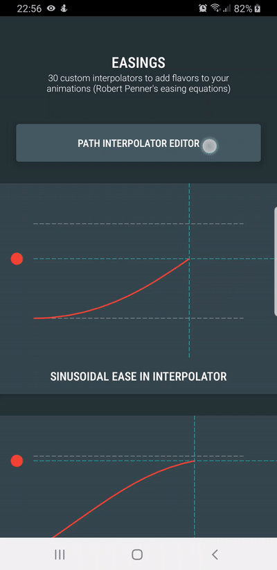
<br/>  
Until a demo gets released on Play, you can execute the sample and see the library's custom interpolators in action. <br/>
You can also experiment with the path interpolator editor to get the control points for a custom interpolator using `PathInterpolatorCompat.create(x1, y1, x2, y2)`.
 
## SETUP  

Dependency should be declared in your app module level  `build.gradle` file:    
    
``` 
dependencies {

    implementation 'com.ramijemli:easings:1.0.0' 

}
```   


## HOW TO USE

This can be used exactly like the native interpolators.

```
ValueAnimator.ofFloat(0f,1f).apply {
    interpolator = Interpolators(Easings.SIN_IN)
    start()
}

ObjectAnimator.ofFloat(textView, "translationX", 100f).apply {
    interpolator = Interpolators(Easings.ELASTIC_IN_OUT)
    start()
}

myView.animate().apply {
    translationYBy(100f)
    interpolator = Interpolators(Easings.BOUNCE_OUT)
    start()
}
```

| Interpolator | Behavior |  
| --- | :---: |
| Sinusoidal ease in<br/> `Easings.SIN_IN` |  | 
| Sinusoidal ease out<br/> `Easings.SIN_OUT` |  | 
| Sinusoidal ease in out<br/> `Easings.SIN_IN_OUT` | 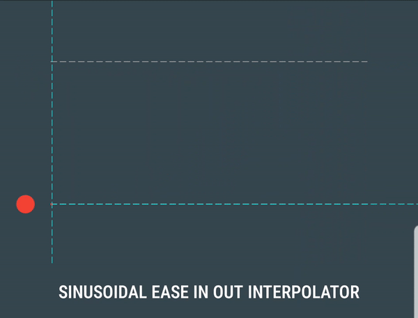 | 
| Quadratic ease in<br/> `Easings.QUAD_IN` | 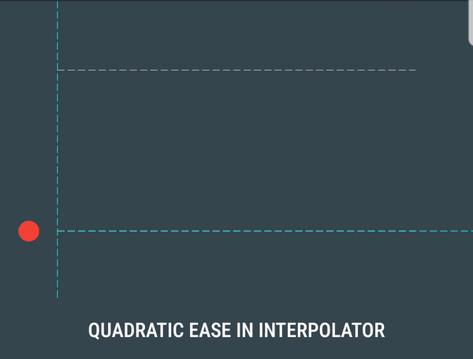 | 
| Quadratic ease out<br/> `Easings.QUAD_OUT` | 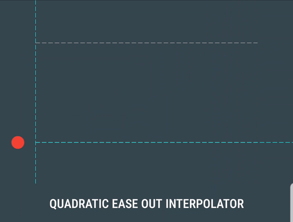 | 
| Quadratic ease in out<br/> `Easings.QUAD_IN_OUT` | 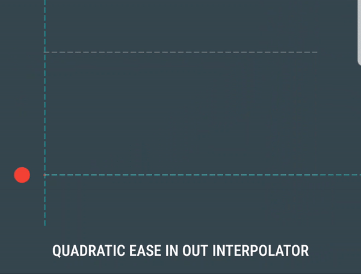 | 
| Cubic ease in<br/> `Easings.CUBIC_IN` | 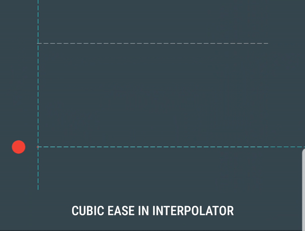 | 
| Cubic ease out<br/> `Easings.CUBIC_OUT` | 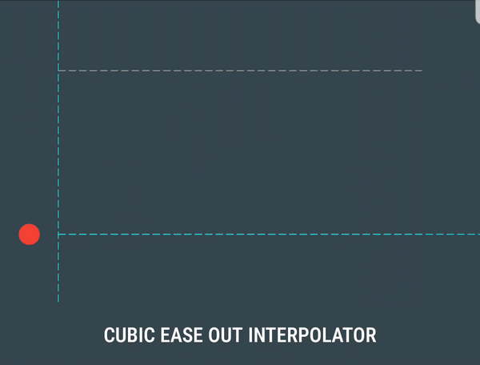 | 
| Cubic ease in out<br/> `Easings.CUBIC_IN_OUT` |  | 
| Quartic ease in<br/> `Easings.QUART_IN` |  | 
| Quartic ease out<br/> `Easings.QUART_OUT` | 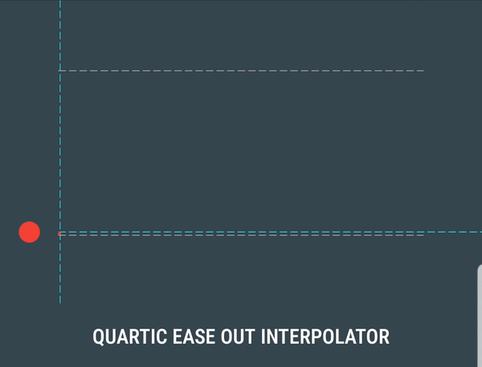 | 
| Quartic ease in out<br/> `Easings.QUART_IN_OUT` | 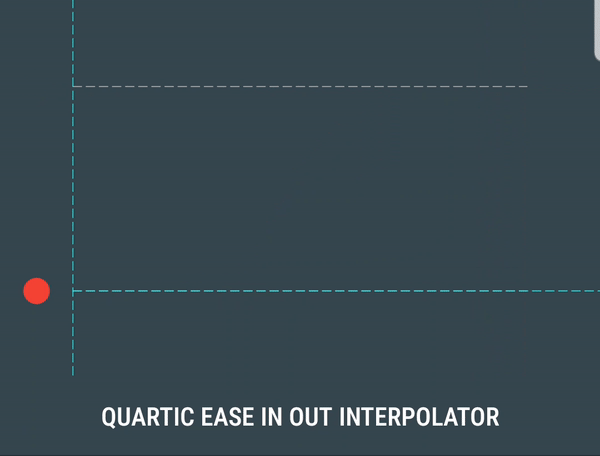 | 
| Quintic ease in<br/> `Easings.QUINT_IN` | 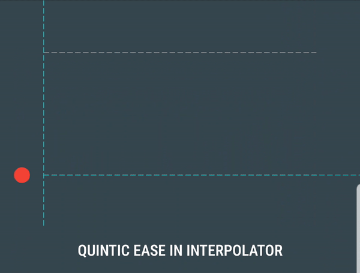 | 
| Quintic ease out<br/> `Easings.QUINT_OUT` | 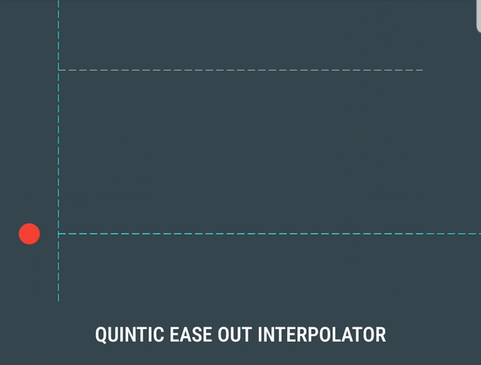 | 
| Quintic ease in out<br/> `Easings.QUINT_IN_OUT` | 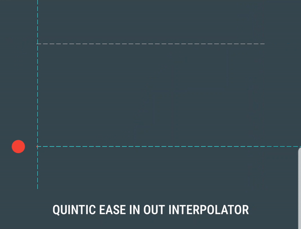 | 
| Exponential ease in<br/> `Easings.EXP_IN` | 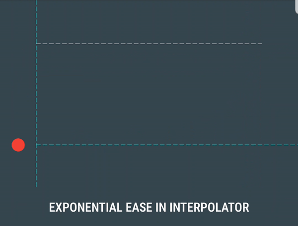 | 
| Exponential ease out<br/> `Easings.EXP_OUT` | 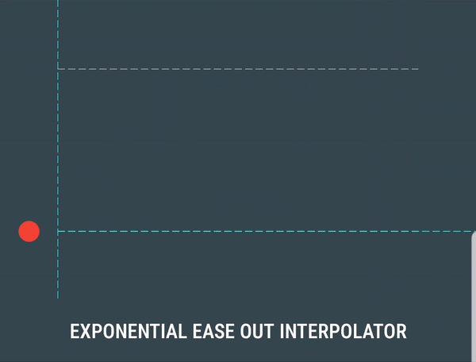 | 
| Exponential ease in out<br/> `Easings.EXP_IN_OUT` | 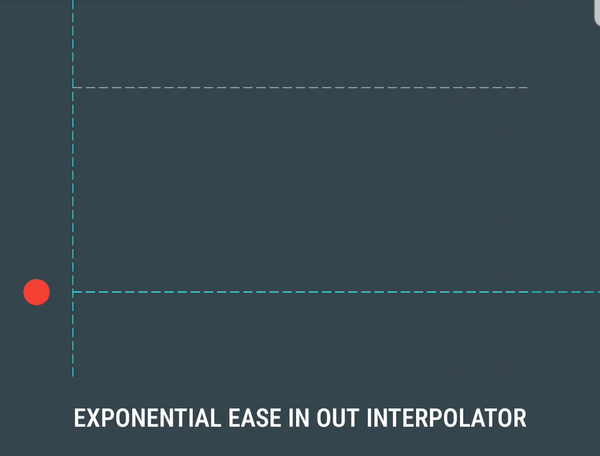 | 
| Circular ease in<br/> `Easings.CIRC_IN` | 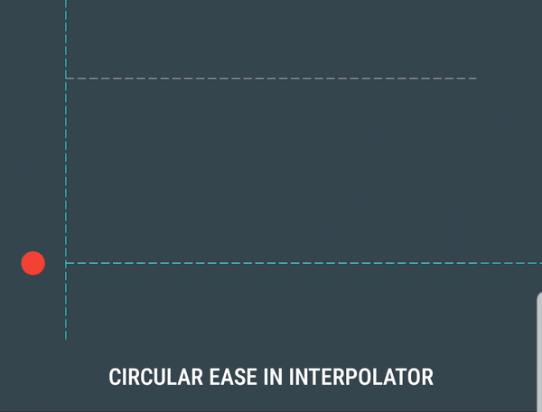 | 
| Circular ease out<br/> `Easings.CIRC_OUT` |  | 
| Circular ease in out<br/> `Easings.CIRC_IN_OUT` | 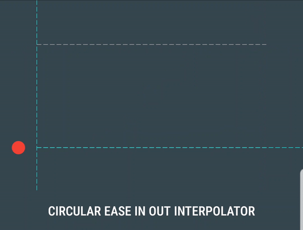 | 
| Back ease in<br/> `Easings.BACK_IN` | 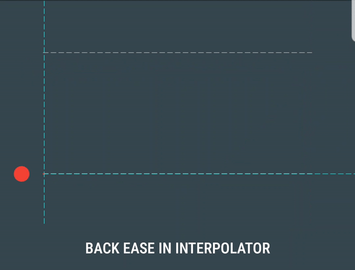 | 
| Back ease out<br/> `Easings.BACK_OUT` | 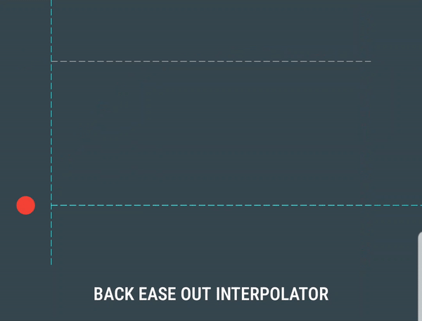 | 
| Back ease in out<br/> `Easings.BACK_IN_OUT` | 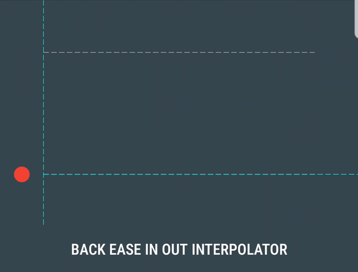 | 
| Elastic ease in<br/> `Easings.ELASTIC_IN` | 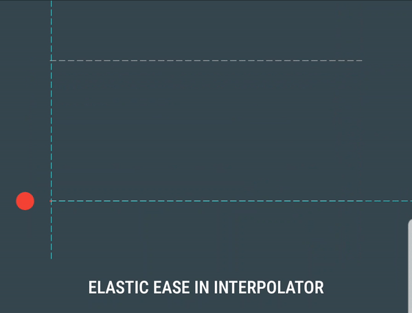 | 
| Elastic ease out<br/> `Easings.ELASTIC_OUT` | 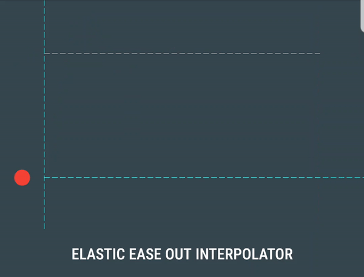 | 
| Elastic ease in out<br/> `Easings.ELASTIC_IN_OUT` | 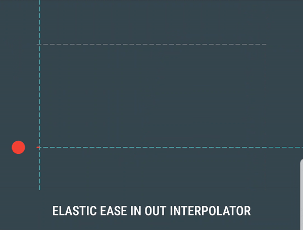 | 
| Bounce ease in<br/> `Easings.BOUNCE_IN` | 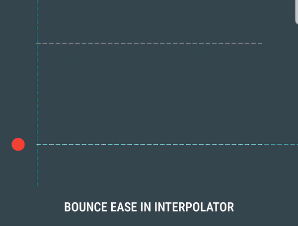 | 
| Bounce ease out<br/> `Easings.BOUNCE_OUT` | 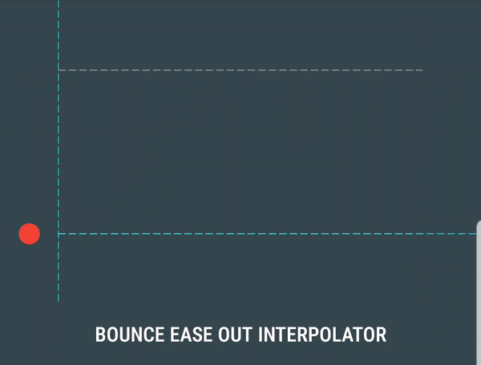 | 
| Bounce ease in out<br/> `Easings.BOUNCE_IN_OUT` | 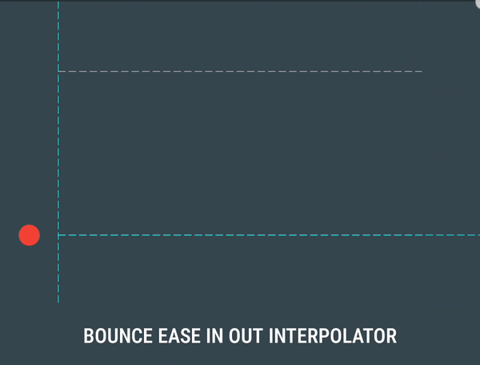 | 

## CONTRIBUTION  

All bugs, feature requests, feedback, etc. are welcome. Please, feel free to [create an issue](https://github.com/RamiJ3mli/Easings/issues).    

If you have new ideas, feel free to contribute by opening pull requests on dev branch. 
 
## APPS USING IT  

Are you using this library in your app? Let us know and we'll show it here.  
  
## TO DO
-   [ ] Add tension modifier for elastic easing  
-   [ ] Add path interpolator editor  
-   [ ] Add sample for google play  

## LICENSE 

```
Copyright 2019 Rami Jemli  
  
Licensed under the Apache License, Version 2.0 (the "License");  
you may not use this file except in compliance with the License.  
You may obtain a copy of the License at  

	http://www.apache.org/licenses/LICENSE-2.0  
 
Unless required by applicable law or agreed to in writing, software distributed
under the License is distributed on an "AS IS" BASIS, WITHOUT WARRANTIES OR CONDITIONS OF ANY KIND,
either express or implied. See the License for the specific language governing permissions 
and limitations under the License.  
```