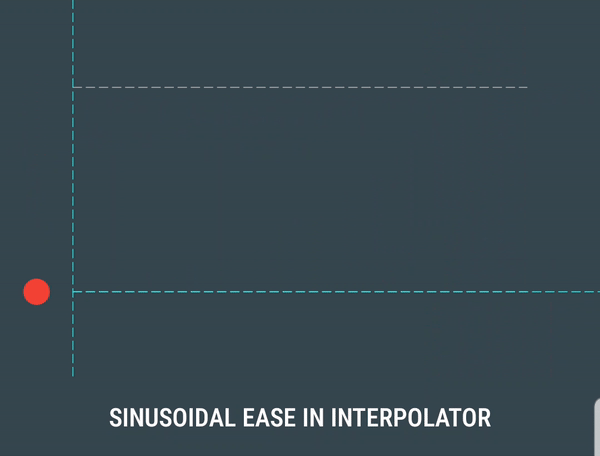
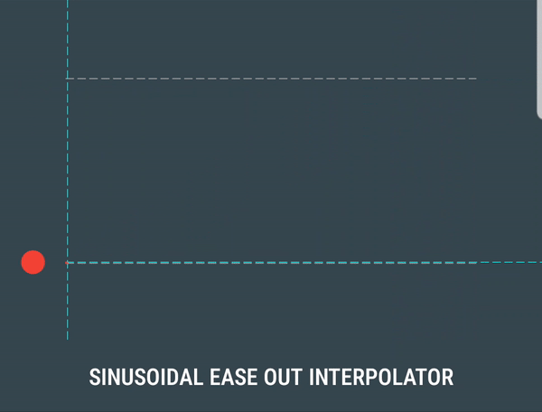

# Easings for Android  

[](https://android-arsenal.com/api?level=16)  
[](http://twitter.com/rami_jemli)  
  
If you are not pleased with the native interpolators on Android. Here are 30 custom ones to make motion look more real. <br/>This small library is a port of Robert Penner's easing equations to kotlin on Android to add flavors to your animations, and it's based on [https://easings.net/](https://easings.net/).
  
## SETUP  

Dependency should be declared in your app module level  `build.gradle` file:    
    
``` 
dependencies {   
	 implementation 'com.ramijemli:easings:1.0.0' 
} 
```   
 
## HOW TO USE

This can be used exactly like the native interpolators.

```
ValueAnimator.ofFloat(0f,1f) .apply { 
	interpolator = Interpolators(Easings.SIN_IN)
	start()  
}

ObjectAnimator.ofFloat(textView,  "translationX",  100f).apply { 
	interpolator = Interpolators(Easings.ELASTIC_IN_OUT)
	start()  
}

myView.animate().apply {  
	translationYBy(100f)  
    interpolator = Interpolators(Easings.BOUNCE_OUT)  
    start()  
}
```

| Interpolator | Behavior |  
| --- | :---: |
| Sinusoidal ease in<br/> `Easings.SIN_IN` |  | 
| Sinusoidal ease out<br/> `Easings.SIN_OUT` |  | 

## CONTRIBUTION  

All bugs, feature requests, feedback, etc. are welcome. Please, feel free to [create an issue](https://github.com/RamiJ3mli/Easings/issues).    

If you have new ideas, feel free to contribute by opening pull requests on dev branch. 
 
## APPS USING IT  

Are you using this library in your app? Let us know and we'll show it here.  
  
## CONTRIBUTORS <table>   
   
<tr>      
<td>      
<a href="https://github.com/RamiJ3mli"></a><br /><sub><center><b>Rami Jemli</b></center></sub>      
</td>      
</tr>      
</table>      
  
## LICENSE 

```
Copyright 2019 Rami Jemli  
  
Licensed under the Apache License, Version 2.0 (the "License");  
you may not use this file except in compliance with the License.  
You may obtain a copy of the License at  

	http://www.apache.org/licenses/LICENSE-2.0  
 
Unless required by applicable law or agreed to in writing, software distributed
under the License is distributed on an "AS IS" BASIS, WITHOUT WARRANTIES OR CONDITIONS OF ANY KIND,
either express or implied. See the License for the specific language governing permissions 
and limitations under the License.  
```